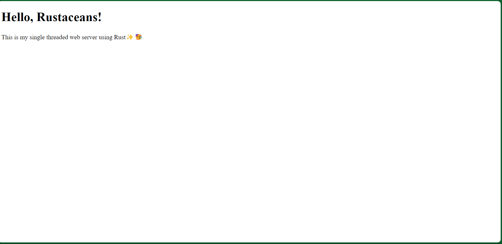

# Simple HTTP Server in Rust
This project is a simple HTTP server written in Rust. It listens for incoming TCP connections, reads HTTP requests, and sends back HTTP responses.

## Code Summary
The main components of the code are:

1. **Main function:** The entry point of the application. It calls the `run_server` function and handles any errors that occur.

2. **run_server function:** This function creates a TCP listener that listens for incoming connections on localhost port 7878. It then handles each incoming connection by calling the `handle_connection` function.

3. **handle_connection function:** This function reads an HTTP request from a TCP stream, determines the appropriate HTTP response, and writes the response back to the stream.

## Detailed Explanation

### Main Function
The main function is the entry point of the application. It calls the `run_server` function and handles any errors that occur by printing them to the standard error output.

### run_server Function
The `run_server` function creates a TCP listener that listens for incoming connections on localhost port 7878. It then handles each incoming connection by calling the `handle_connection` function.

If the `run_server` function encounters an error (such as failing to bind the TCP listener), it returns the error to the caller.

### handle_connection Function
The `handle_connection` function reads an HTTP request from a TCP stream, determines the appropriate HTTP response, and writes the response back to the stream.

The function first reads the request line from the stream. If the request line is "GET / HTTP/1.1", the function responds with a 200 OK status and the contents of the "src/hello.html" file. Otherwise, it responds with a 404 Not Found status and the contents of the "src/404.html" file.

If the function encounters an error (such as failing to read from the stream or failing to read a file), it returns the error to the caller.

## Output

```bash
$ cargo run
    Finished dev [unoptimized + debuginfo] target(s) in 0.01s
     Running `target/debug/http_server`
Server running on http://127.0.0.1:7878/
```

---

Client side output:

<!-- Include the screenshot -->



## What I Learned
- How to create a TCP listener in Rust.
- How to handle incoming TCP connections in Rust.
- How to read from and write to TCP streams in Rust.
- How to read from and write to files in Rust.
- How to handle errors in Rust.